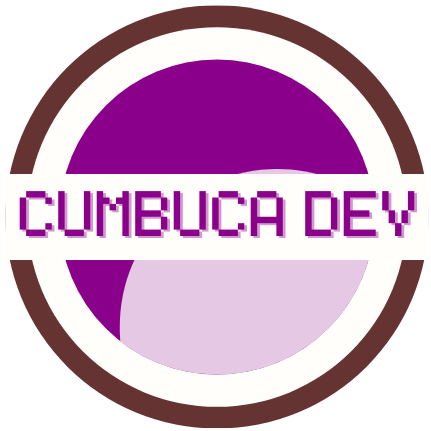

# Cumbuca-Dev-Call4papers

  

Este repositório foi criado pela comunidade Cumbuca para facilitar o acampanhamento dos eventos da comunidade. Esperamos melhorar a experiência de todos os participantes e organizadores de eventos e manter um ambiente de aprendizado colaborativo.

<table>
    <thead>
        <tr>
            <th>Evento&nbsp;</th>
            <th>Data/Hora</th>
            <th>Local/Link</th>
            <th>Modelo&nbsp;</th>
            <th>Descrição</th>
        </tr>
    </thead>
    <tbody>
        <tr>
            <td></td>
            <td></td>
            <td></td>
            <td></td>
            <td></td>
        </tr>
    </tbody>
</table>

## Contribuindo
Contribuições são bem-vindas! Sinta-se à vontade para abrir um Pull Request ou relatar problemas. Para mais detalhes, consulte o [CONTRIBUTING.md](./CONTRIBUTING.md).